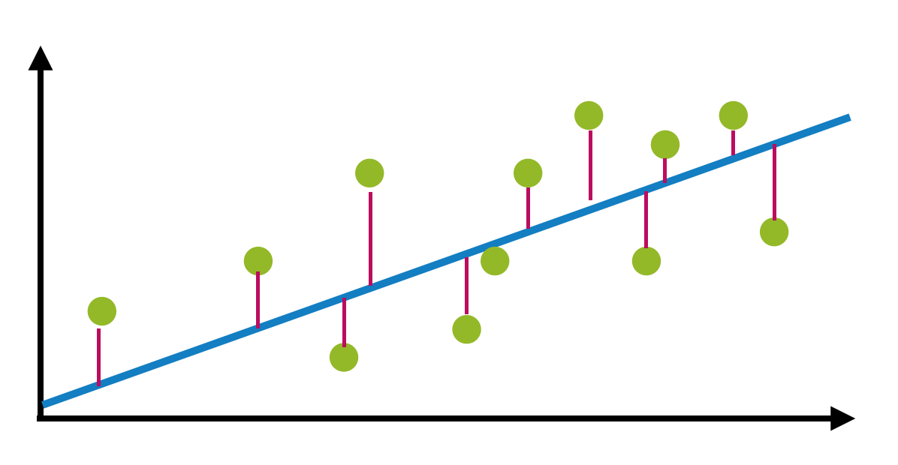

# LinearRegression-cheatsheet
This is a cheatsheet for a simple linear regression.

## Main Features
- Data preparation and cleaning
- Train and score a linear model

# Linear Regression
- <a href="https://scikit-learn.org/stable/modules/generated/sklearn.linear_model.LinearRegression.html">Official Doc</a>
- fit a line to your data
- usefull if the data has a linear relationship
- `` y = mx+b``
- goal is to minimize the red line between the line and the dots

# The Dataset

## Business goal
The objective is to explain AmountSpent in terms of the provided customer characteristics.

## Direct Marketing - Amount Spent by Customers
Source: https://www.kaggle.com/yoghurtpatil/direct-marketing

### Dataset Documentation
The data set includes data from a direct marketer who sells his products only via direct mail. He sends catalogs with product characteristics to customers who then order directly from the catalogs. The marketer has developed customer records to learn what makes some customers spend more than others. The data set includes n = 1000 customers and the following variables:
- Age (of customer; old/middle/young);
- Gender (male/female);
- OwnHome (whether customer owns home; yes/no)
- Married (single/married);
- Location (far/close; in terms of distance to the nearest brick and mortar store that sells similar products); 
- Salary (yearly salary of customer; in dollars);
- Children (number of children; 0–3); 
- History (of previous purchase volume; low/medium/high/NA; NA means that this customer has not yet purchased); 
- Catalogs (number of catalogs sent);
- and AmountSpent (in dollars).